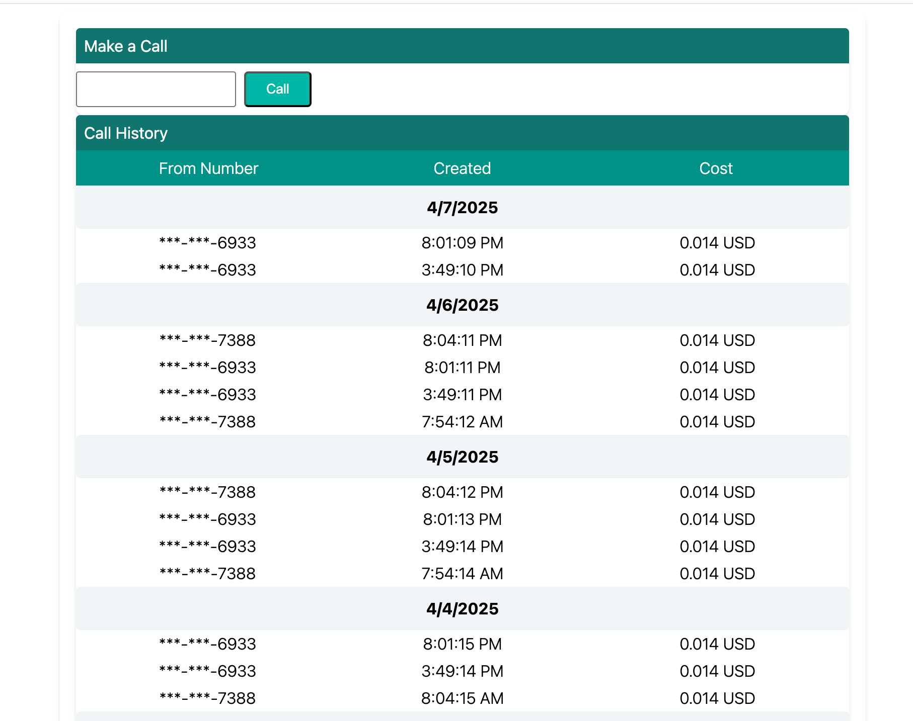
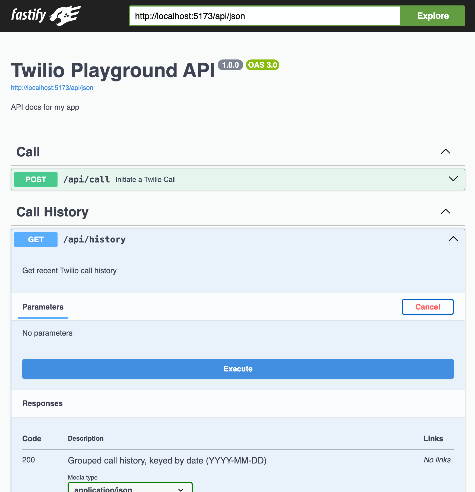

### Twilio Playgound</img>

</img>
</img>

#### Requirement

Sign up for a twilio account and purchase a phone number.

Then, add your account credential to the .env file

```
TWILIO_ACCOUNT_SID=***YOUR ACCOUNT SID**
TWILIO_AUTH_TOKEN=***YOUR AUTH TOKEN***
TWILIO_PHONE_NUMBER=***YOUR PHONE NUMBER***
```

---

#### Install

Run these command in the root directory

- `pnpm i`
- `pnpm run dev`

---

This application is still work-in-progress.
But It serve the purpose of

- testing integration with twilio api endpoint.
- applying tailwind utility class to call history component
- making asynchronous call to twilio api
- integration with swagger UI to display documentation for API

* Completed:
  - Responsive UI (client)
    - Option to make call to any number
    - Display call history, grouped calls by date
  - Backend (sever)
    - Use Swagger UI to test api endpoints
    - Transform sensitive data (masking phone number)
    - Transform call histories, grouped/keyed by date (YYYY-MM-DD)

---

- To Do:
  - Optimization
    - Compress all js in production build, reduce bundle size with vite configuration.
    - Use react profiler and lighthouse to identify performance bottlenecks
    - server side rendering SSR using Next.js
    - purge css in production build
  - UI
    - Add login and logout
    - For logged in user
      - Frontend
        - Add options (twilio xml templates) to automate key presses
        - Add a page for user to create create call-instruction template
        - Add a page to display recorded calls (mp4)
        - Display templates created by current user
      - Backend
        - Add another endpoint to display recorded calls
        - Setup database source, so we can store instructions we attached to Twilio call.
